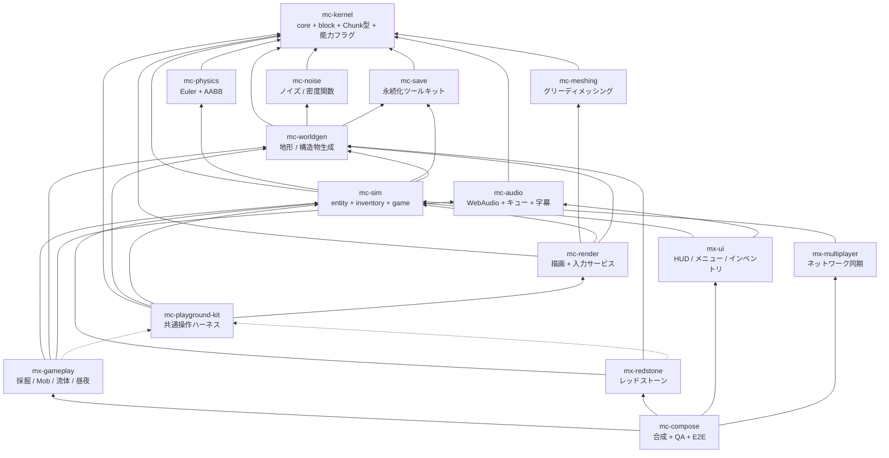

# アーキテクチャ

- 根拠: 現行の workspace 構成、依存宣言、CI と参照実装
- 参照実装: `takeokunn/ts-minecraft`（凍結。仕様書兼テストオラクル）

## 1. なぜ 16 リポジトリなのか

単一リポジトリ（参照実装は 84k LOC）では「正しく動くことが保証される単位」が大きすぎ、
検証しきれない。分割の解決策は次の 1 行に尽きる:

> ゲーム UX を構成する体験単位ごとにリポジトリを分け、それぞれが「実際にユーザが操作できるプレビュー」を同梱する

各リポジトリは「テスト green + プレビューで目視確認済み」で正しさを単独で閉じ、
合成リポジトリ（mc-compose）は各モジュールを束ねるだけの場所になる。

## 2. 4 階層

| 階層 | リポジトリ | 性質 |
| --- | --- | --- |
| 安定ライブラリ | kernel / **noise** / **meshing** / **physics** / save / audio | 純粋関数・狭い界面・変更頻度が低い。相互独立で並行構築可能 |
| 基盤 | worldgen / sim / render / playground-kit | 状態とサービス（**名詞**）。体験モジュールが乗る土台 |
| 体験モジュール | gameplay / redstone / ui / multiplayer | ルールと UI（**動詞**）。互いを知らず、基盤サービス経由でのみ会話 |
| 合成 | compose | Layer マージ + stage 順序表 + E2E。ロジックを持たない |

## 3. 依存グラフ（全体）



実線 = 実行時依存（`dependencies`）、点線 = プレビュー起動時のみ（`devDependencies`）。
許可グラフの正典は各リポジトリの依存宣言、lint 設定、CI であり、この図と実効設定の
内容が一致していることをレビューで確認する（§6 参照）。

## 4. このリポジトリの位置

**mc-noise は最下層に近い「安定ライブラリ」層に属する。**

- **親（このリポジトリが依存してよい先）**: `mc-kernel` のみ。
- **子（このリポジトリに依存する側）**: `mc-worldgen` ただ 1 つ。

依存が kernel だけで閉じているということは、mc-noise が「シードと座標だけの関数」であることを
機械的に保証しているという意味である。もしこの許可リストが増えたなら、それはまず設計の異常であって、
設定の変更ではない。

子が `mc-worldgen` 1 つしかないのは弱点ではなく、**凍結を可能にする条件**である。
このリポジトリが「seed→値のインターフェースは凍結扱い」と宣言できるのは、
変更の影響範囲が 1 リポジトリに閉じているからではなく、逆に、
その 1 リポジトリを通じて**過去に生成されたすべてのワールドの地形**に波及するからである。
詳細は `versioning.md` を読むこと。

## 5. 構成の成立条件

### 5.1 基盤 = 名詞、体験 = 動詞（§2.3-1）

`InventoryService` のような**状態の置き場**は基盤層に置く。
「掘ったらドロップしてインベントリに入る」という**ルール**は体験層に置く。

体験モジュール（`mx-*`）間の依存エッジは**ゼロ**である。
「採掘 → インベントリに入る」は mx-gameplay が mx-ui を呼ぶのではなく、
mc-sim の `InventoryService` を経由して実現する。

このルールは依存宣言と lint の許可グラフに埋め込まれている（§6 参照）。

安定ライブラリ層は名詞でも動詞でもなく**関数**である。状態を持たず、サービスを提供せず、
`Layer` を公開しない。この層に `Ref` が現れたら設計を疑うこと。

### 5.2 mc-playground-kit が devDependency 専用である理由（§2.3-2）

**実行時入力サービス（キーボード / マウス / ポインタロック / タッチ / キーリマッピング）を
所有するのは mc-render であって mc-playground-kit ではない。**

mc-playground-kit は「ミニ平地ワールド + カメラ + レンダラ + 入力を 1 秒で束ねる糊」であり、
各体験モジュールからは **devDependency としてのみ**参照される。
もし入力サービスを kit 側に置いたら、kit は出荷ビルドに含まれないので、
**本番ゲームから入力処理が丸ごと消える**。

したがって:

- `mc-playground-kit` が `dependencies` に現れたら依存境界に反し、レビューで拒否する。
- 出荷ソース（`index.ts` と `domain/`）からの import も失敗する。
- roster では **ノードとしては存在する**（kit 自身は worldgen / sim / render に実行時依存する）が、
  **どの行のターゲットにも現れない**。devDependency は実行時の辺を作らないので、循環にも参加しない。

なお mc-noise は kit を devDependency としても使わない。プレビューを持たない層だからである。

### 5.3 stage 実行順序表は mc-compose が唯一所有する（§2.3-3）

各モジュールは `StageRegistration` で**順序制約（`after`）を宣言するだけ**であり、
全順序（total order）を解決するのは mc-compose ただ 1 つである。

```typescript
// mc-kernel が型を定義。各体験モジュールが実装して公開する
interface StageRegistration {
  readonly id: StageId
  readonly after?: ReadonlyArray<StageId>   // 順序制約の宣言のみ
  readonly run: (dt: DeltaTimeSecs) => Effect.Effect<void, never, FrameServices>
}
```

標準の全順序の骨格:

```
input
  -> simulation (physics -> interactions -> entities -> fluids -> redstone -> time/weather)
  -> camera-mirror
  -> chunk-sync
  -> render
  -> post-fx
  -> hud-sync
```

mc-noise は stage を登録しない。安定ライブラリ層は毎フレーム走るものではなく、
mc-worldgen がチャンク生成のときに呼ぶ純粋関数だからである。
`StageRegistration` の型は mc-kernel が所有しており、mc-noise はそれを import すらしない。

参照実装の轍: 合成層に 13k LOC のルールが堆積し、E2E でしか検証できなくなった。
「mc-compose の追加コードは Layer 合成と stage 順序表だけ」がレビュー規範である。

## 6. 依存の実効機構（§2.3-5）

実効機構は各リポジトリの `.oxlintrc.json` の `no-restricted-imports` と `pnpm lint` による
出荷ソースの import 境界検査であり、循環・推移依存・宣言の一致はレビューで確認する。

| ルール | 内容 | 現在の実効機構 |
| --- | --- | --- |
| 上位 Tier への依存禁止 | mc-noise（Tier1）は org 内のどの `@nerima-games/*` にも依存できない | `.oxlintrc.json` の `no-restricted-imports`（`mc-kernel` を除外） |
| 循環禁止 | 例外リストを設けない | レビュー（依存境界の規約） |
| 推移閉包の禁止 | A→B、B→C のとき A は C を import できない | レビュー（依存境界の規約） |
| kernel は例外 | mc-kernel はどこからでも import 可。ただし `package.json` への記載は必要 | `.oxlintrc.json` のパターンが `mc-kernel` を除外 |
| 宣言と実体の一致 | import する `@nerima-games/*` は `package.json` に記載されていなければならない | レビュー（自動チェックなし） |
| kit は devDependency 専用 | §5.2 のとおり（mc-noise は kit 自体を使わない） | レビュー |
| `Date.now()` 禁止 | `Date.now()` / `new Date()` / `performance.now()` の 3 つ。時刻は注入された Clock Port から取得する | ソースポリシー。現在の lint 設定では自動強制していない |

`Date.now()` 禁止は現在、ソースポリシーとして扱っている。リポジトリ内に時間依存を持ち込まない
ことは `rg` による監査で確認できるが、現在の `.oxlintrc.json` にはこの構文を自動拒否する
ルールを設定していない。そのため、この方針を CI の lint ゲートであるかのようには扱わない。
将来、時間を扱う層が必要になった場合も、決定論的なドメイン関数へ時計を直接参照させず、所有側
から注入する。

## 7. 公開依存の境界

`package.json` の runtime dependency は `effect` と `@nerima-games/mc-kernel` である。
`src/domain/chunk-sampling.ts` は kernel の `ChunkCoord` と `CHUNK_SIZE_XZ` を使って
チャンク境界を本リポジトリの補間グリッドへ変換する。座標語彙とチャンク幅は kernel の定義を
再実装せず、ノイズの seed・勾配・補間・サンプリングは本リポジトリが所有する。

設定済みの `NoiseRouter`、地形スプライン、ブロック生成はこの依存境界を越えて持ち込まない。
それらは上位の `mc-worldgen` が公式仕様とともに管理する。一方、ノイズチャンネルを使う気候・バイオーム分類、
地形高、湖、水面、表面材質、1 列の純粋な評価と、portable `DensityFunction` の代数・境界値・評価器は
mc-noise が所有し、`mc-worldgen` はそれらを公式のワールド設定や地形式、チャンクへのブロック適用と組み合わせる。

## 参照

- `responsibility.md` — このリポジトリの責務と、意図的に含めないもの
- `public-api.md` — 公開 API と参照実装での裏付け
- `design-notes.md` — 設計注意とその回帰テスト名
- `versioning.md` — 0.x → 1.0.0 の方針と publish
